# **Design Document**

<table>
  <tr>
    <td>Author</td>
    <td>Version </td>
    <td>Date</td>
    <td>Comments</td>
  </tr>
  <tr>
    <td>Team 71</td>
    <td>1.0</td>
    <td>10/05/2016</td>
    <td>Initial draft</td>
  </tr>
</table>

## **1 Design Considerations**

### **1.1 Assumptions**

The following lists describes the assumptions, background, or dependencies of the software, its use, the operational environment, or significant project issues.

1. Minimum android API is API 19

2. Compilation SDK is SD 24

3. Build tool version is 24.0.1

4. Appcompat library is 24.2.1

5. SQLite database hosts data on device (not on cloud)

### **1.2 Constraints**

This list describes the primary constraints on the system that have a significant impact on the design of the system.

1. The application is restricted to Android OS

2. The user cannot add new Item type

The main constraint on the system is the need for internet to fetch the grocery list and items on each list. A dedicated data connection is also required for various CRUD activities.

### **1.3 System Environment**

This section describes the hardware and software that the system must operate in and interact with.

The app requires Android device with minimum APK of 19. The application runs on both the phone and tablet.

## **2 Architectural Design**

### **2.1 Component Diagram**

The application has three main components: 

1. GroceryList (GL)

2. Persistence Controller (PC)

3. Database (DB)

The GroceryList is the main component of the application. Users can create and update items on the list. It helps in accessing various grocery list items and individual items. The list records additional user actions like deleting items and unchecking items from the list.

The Persistence Controller acts as a brokerage layer between the list and the database. This component maintains the system state to fetch data from the database and store the grocery lists. This component is useful when, for example, the user is in the middle of modifying the grocery list when they receive a phone call. The PC component will remember the system state when the user returns to the application after their phone call.

The Database component stores the various grocery list items and the individual items in the list. It also saves the user created grocery list and its states. 

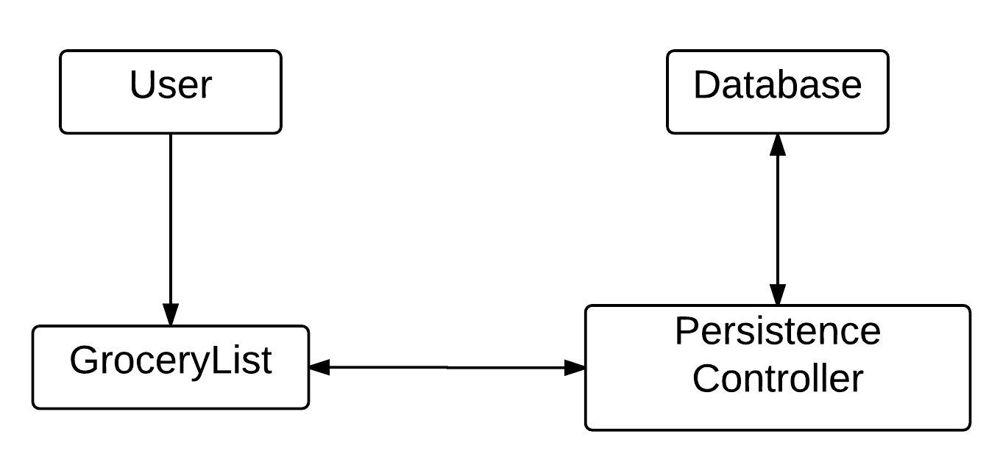

**Figure 1: Three components of the system along with the user**

### **2.2 Deployment Diagram**

The application can be installed on the client device by either of two ways: 

1. by release the app in the google play store and 

2. by downloading the application APK in the device. 

This system and the process is simple and intuitive and thus doesn’t require a dedicated deployment diagram. 

## **3 Low-Level Design**

### **3.1 Class Diagram**

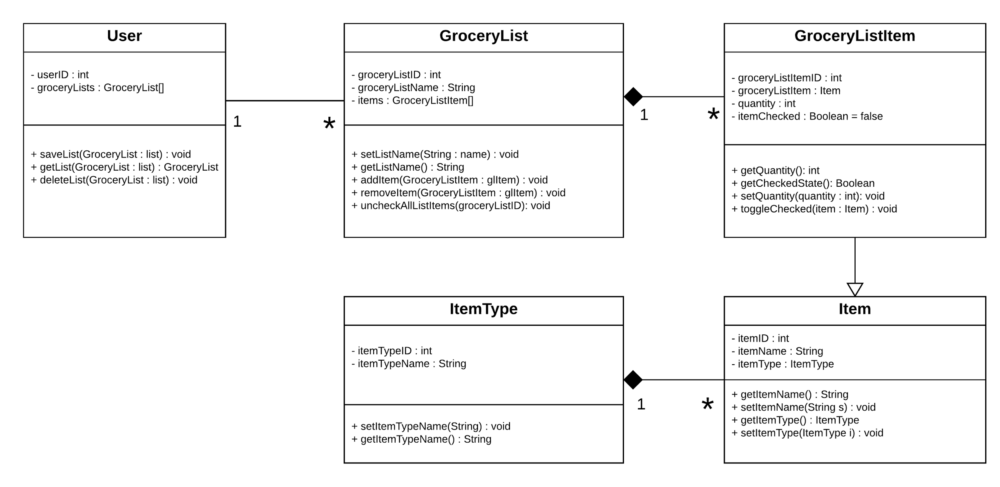**Figure 2: UML class model diagram of the system**

### **3.2 Other Diagrams**

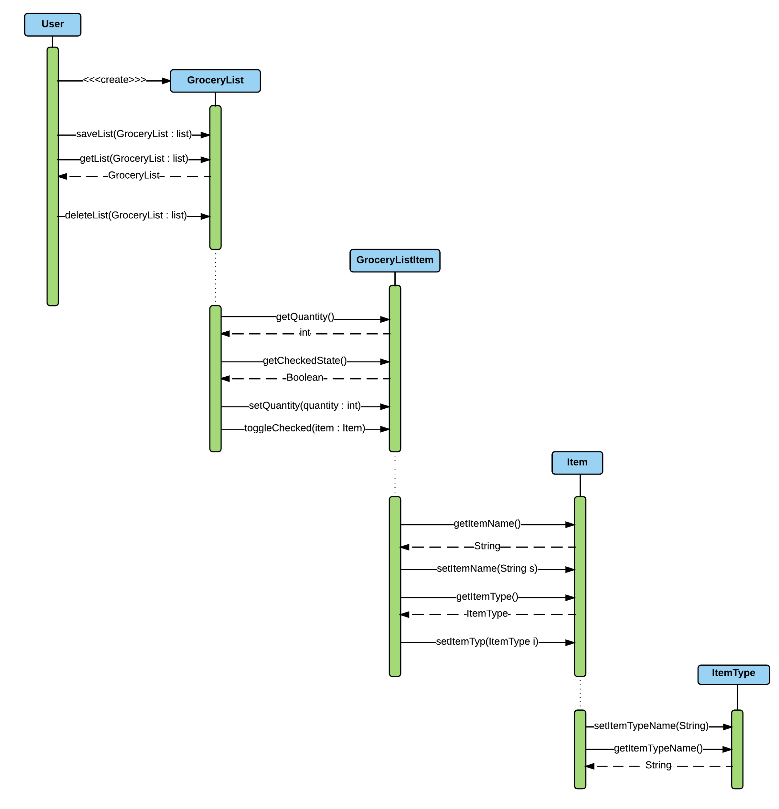

**Figure 3: Sequence diagram displaying the execution of various tasks in the application.**

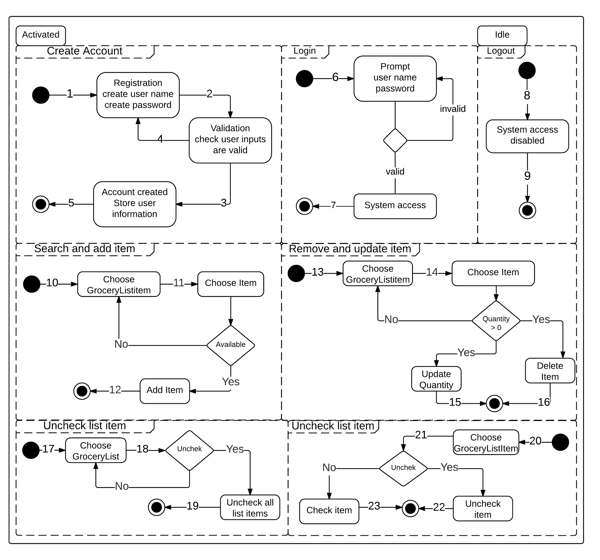

**Figure 1: State chart diagram for the grocery list application**

**Table 1: ****State number and their descriptions**

<table>
  <tr>
    <td>State number</td>
    <td>Description
 </td>
  </tr>
  <tr>
    <td>1</td>
    <td>Create account selected</td>
  </tr>
  <tr>
    <td>2</td>
    <td>Submit registration details</td>
  </tr>
  <tr>
    <td>3</td>
    <td>User input validation pass</td>
  </tr>
  <tr>
    <td>4</td>
    <td>User input validation fail</td>
  </tr>
  <tr>
    <td>5</td>
    <td>Account create complete</td>
  </tr>
  <tr>
    <td>6</td>
    <td>User login</td>
  </tr>
  <tr>
    <td>7</td>
    <td>User login complete</td>
  </tr>
  <tr>
    <td>8</td>
    <td>User logout</td>
  </tr>
  <tr>
    <td>9</td>
    <td>User logout complete</td>
  </tr>
  <tr>
    <td>10</td>
    <td>Search and add item selected, user chooses grocery list item</td>
  </tr>
  <tr>
    <td>11</td>
    <td>User chooses an item</td>
  </tr>
  <tr>
    <td>12</td>
    <td>Search and add item complete</td>
  </tr>
  <tr>
    <td>13</td>
    <td>Remove and update item selected, user chooses grocery list item</td>
  </tr>
  <tr>
    <td>14</td>
    <td>User chooses an item</td>
  </tr>
  <tr>
    <td>15</td>
    <td>Quantity update complete</td>
  </tr>
  <tr>
    <td>16</td>
    <td>Delete item complete</td>
  </tr>
  <tr>
    <td>17</td>
    <td>Uncheck list item selected, user chooses grocery list item</td>
  </tr>
  <tr>
    <td>18</td>
    <td>Check check/uncheck status of grocery list</td>
  </tr>
  <tr>
    <td>19</td>
    <td>Uncheck all list items complete</td>
  </tr>
  <tr>
    <td>20</td>
    <td>Uncheck list item selected, user chooses grocery list item</td>
  </tr>
  <tr>
    <td>21</td>
    <td>Check check/uncheck status of grocery list item</td>
  </tr>
  <tr>
    <td>22</td>
    <td>Uncheck item complete</td>
  </tr>
  <tr>
    <td>23</td>
    <td>Check item complete</td>
  </tr>
</table>

## **4 User Interface Design**

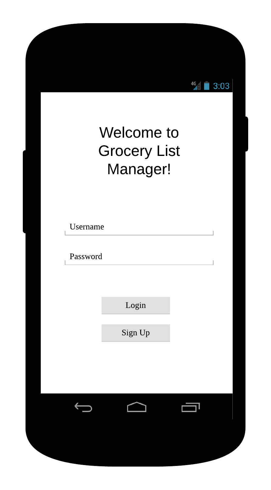

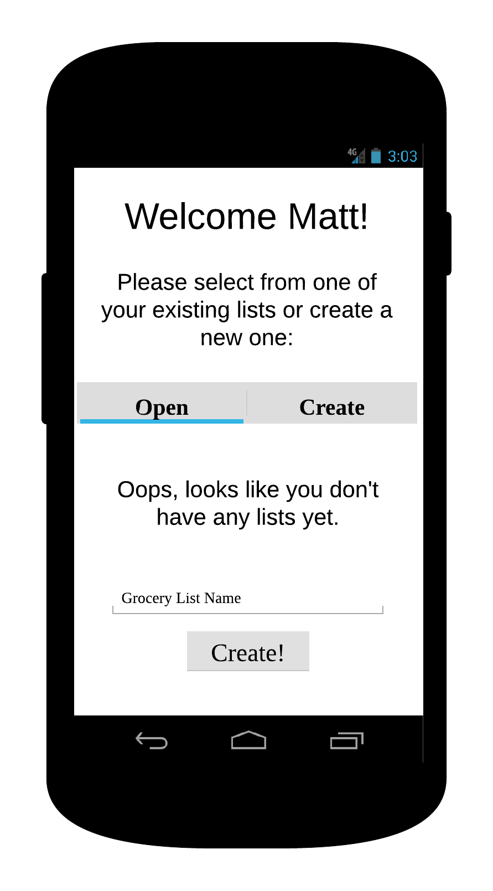

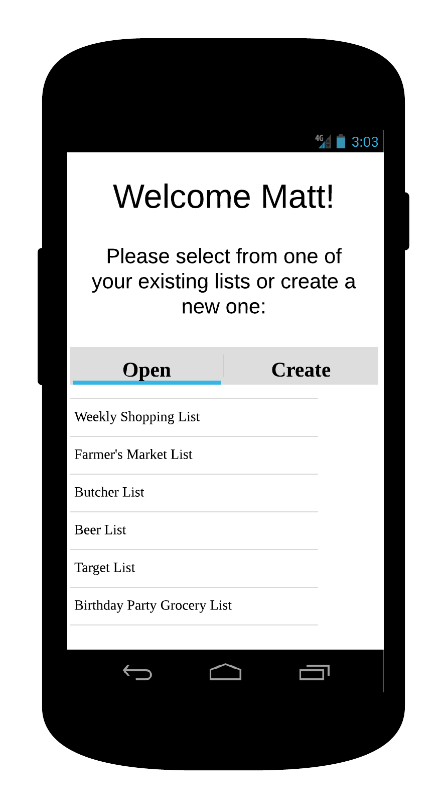

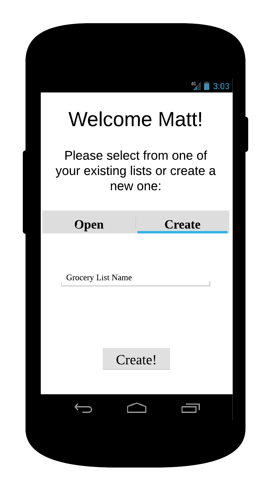

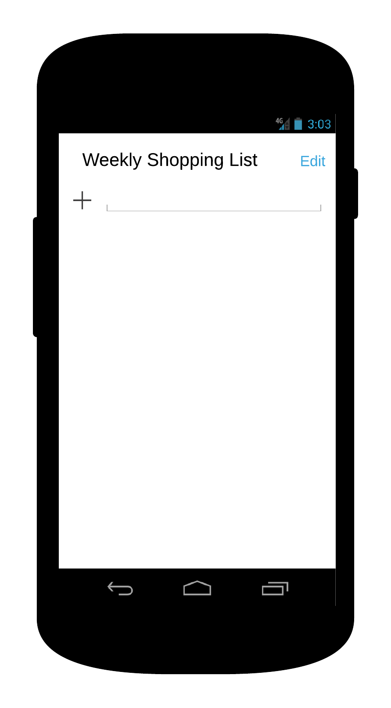

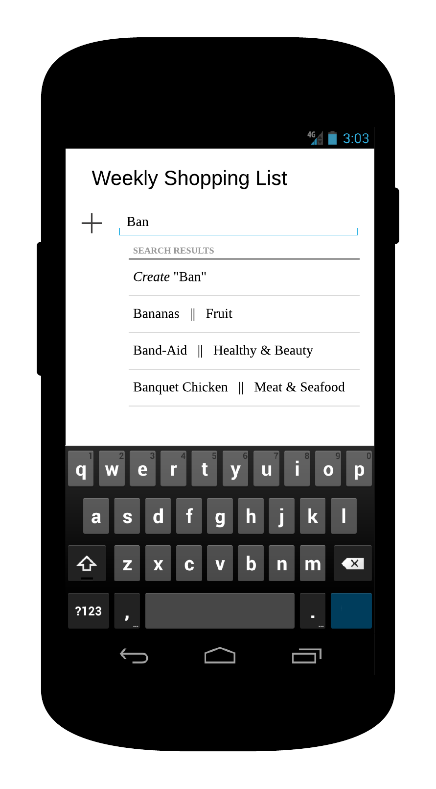

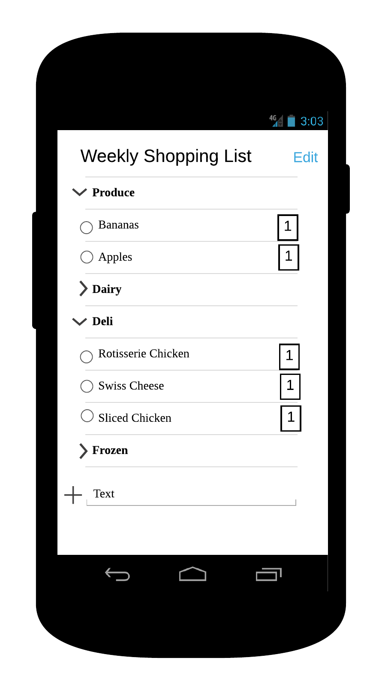

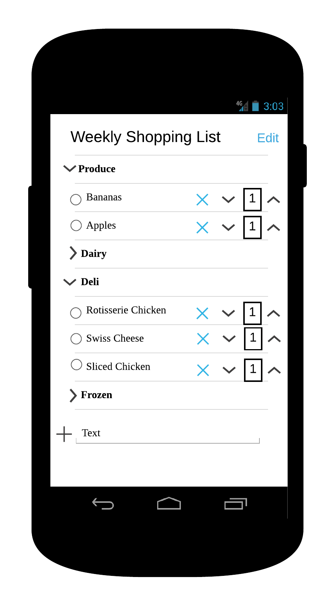

