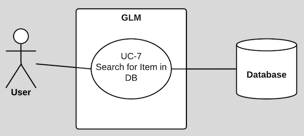

# **Use Case Model**

<table>
  <tr>
    <td>Author</td>
    <td>Version </td>
    <td>Date</td>
    <td>Comments</td>
  </tr>
  <tr>
    <td>Team 71</td>
    <td>1.1</td>
    <td>10/10/2016</td>
    <td>Updated use cases with individual diagrams and detailed description</td>
  </tr>
  <tr>
    <td>Team 71</td>
    <td>1.0</td>
    <td>10/05/2016</td>
    <td>Initial draft</td>
  </tr>
</table>

## **1 Use Case Diagram**

## **1.1.1 Use case diagram**

**Figure 1: UC-1 Create grocery list**

## **1.1.2 UC-1 Use case description**

<table>
  <tr>
    <td>Use Case ID</td>
    <td>UC - 1</td>
  </tr>
  <tr>
    <td>Use Case Name</td>
    <td>Create grocery list</td>
  </tr>
  <tr>
    <td>Created by</td>
    <td>Team 71</td>
  </tr>
  <tr>
    <td>Date Created</td>
    <td>10/10/2016</td>
  </tr>
  <tr>
    <td>Actors</td>
    <td>User, GLM</td>
  </tr>
  <tr>
    <td>Description
</td>
    <td>This use case describes the creation and storing of the grocery list. Use case must allow a user to create a grocery list with a name of their choosing.</td>
  </tr>
  <tr>
    <td>Scenarios</td>
    <td>User is presented with a form to capture the grocery list name and a button which saves the form upon clicking.</td>
  </tr>
  <tr>
    <td>Pre-conditions
</td>
    <td>No pre-conditions are required to be true to create a grocery list.</td>
  </tr>
  <tr>
    <td>Post-conditions
</td>
    <td>The user will automatically be selecting the newly created list after save.</td>
  </tr>
  <tr>
    <td>Frequency of use</td>
    <td>Weekly</td>
  </tr>
  <tr>
    <td>Impacted Essential Process</td>
    <td>N/A</td>
  </tr>
  <tr>
    <td>Main Flow of events </td>
    <td></td>
  </tr>
  <tr>
    <td>Actor Actions</td>
    <td>System Responses</td>
  </tr>
  <tr>
    <td>User creates a grocery list.</td>
    <td>The GLM system receives request for the creation of a list.
The system creates a list and stores it in the database.
The use case ends.</td>
  </tr>
</table>

## **1.2.1 Use case diagram**

**Figure 2: UC-2 Select grocery list**

## **1.2.2 UC-2 Use case description**

<table>
  <tr>
    <td>Use Case ID</td>
    <td>UC - 2</td>
  </tr>
  <tr>
    <td>Use Case Name</td>
    <td>Select grocery list</td>
  </tr>
  <tr>
    <td>Created by</td>
    <td>Team 71</td>
  </tr>
  <tr>
    <td>Date Created</td>
    <td>10/10/2016</td>
  </tr>
  <tr>
    <td>Actors</td>
    <td>User, GLM</td>
  </tr>
  <tr>
    <td>Description
</td>
    <td>This use case describes the selection of a grocery list by the user. Use case must allow the user to select a saved grocery list.</td>
  </tr>
  <tr>
    <td>Scenarios</td>
    <td>User is presented with an existing grocery list. </td>
  </tr>
  <tr>
    <td>Pre-conditions
</td>
    <td>A grocery list must have been saved before to select.</td>
  </tr>
  <tr>
    <td>Post-conditions
</td>
    <td>User selects the grocery list.</td>
  </tr>
  <tr>
    <td>Frequency of use</td>
    <td>Daily</td>
  </tr>
  <tr>
    <td>Impacted Essential Process</td>
    <td>N/A</td>
  </tr>
  <tr>
    <td>Main Flow of events </td>
    <td></td>
  </tr>
  <tr>
    <td>Actor Actions</td>
    <td>System Responses</td>
  </tr>
  <tr>
    <td>User selects a grocery list.</td>
    <td>The GLM system receives request for the selection of a list.
The system allows the user to select the list.
The use case ends.</td>
  </tr>
</table>

## **1.3.1 Use case diagram**

**Figure 3: UC-3 Add item to grocery list**

## **1.3.2 UC-3 Use case description**

<table>
  <tr>
    <td>Use Case ID</td>
    <td>UC - 3</td>
  </tr>
  <tr>
    <td>Use Case Name</td>
    <td>Add item to grocery list</td>
  </tr>
  <tr>
    <td>Created by</td>
    <td>Team 71</td>
  </tr>
  <tr>
    <td>Date Created</td>
    <td>10/10/2016</td>
  </tr>
  <tr>
    <td>Actors</td>
    <td>User, GLM</td>
  </tr>
  <tr>
    <td>Description
</td>
    <td>This use case describes the addition of an item to a grocery list by a user. Use case must allow a user to add an item to the grocery list they are currently using.</td>
  </tr>
  <tr>
    <td>Scenarios</td>
    <td>User is presented with an existing grocery list and item(s).</td>
  </tr>
  <tr>
    <td>Pre-conditions
</td>
    <td>There must be a grocery list selected before this case is run.
There must be items in database before this case is run.
The item being added to the grocery list must not exist in the list already.</td>
  </tr>
  <tr>
    <td>Post-conditions
</td>
    <td>There must be a new item in the grocery list.</td>
  </tr>
  <tr>
    <td>Frequency of use</td>
    <td>Daily</td>
  </tr>
  <tr>
    <td>Impacted Essential Process</td>
    <td>N/A</td>
  </tr>
  <tr>
    <td>Main Flow of events </td>
    <td></td>
  </tr>
  <tr>
    <td>Actor Actions</td>
    <td>System Responses</td>
  </tr>
  <tr>
    <td>User selects a grocery list.</td>
    <td>The GLM system receives request for the selection of a list.
The system allows the user to select the list.</td>
  </tr>
  <tr>
    <td>2. User selects an item for the grocery list.</td>
    <td>3. The item gets added to the grocery list.
4.  The use case ends.</td>
  </tr>
</table>

## **1.4.1 Use case diagram**

**Figure 4: UC-4 Change the quantity of a grocery list**

## **1.4.2 UC-4 Use case description**

<table>
  <tr>
    <td>Use Case ID</td>
    <td>UC - 4</td>
  </tr>
  <tr>
    <td>Use Case Name</td>
    <td>Change the quantity of a grocery list item</td>
  </tr>
  <tr>
    <td>Created by</td>
    <td>Team 71</td>
  </tr>
  <tr>
    <td>Date Created</td>
    <td>10/10/2016</td>
  </tr>
  <tr>
    <td>Actors</td>
    <td>User, GLM</td>
  </tr>
  <tr>
    <td>Description
</td>
    <td>This use case describes the process of changing the quantity of grocery list item. Use case must allow the user to change the quantity of a grocery list item.</td>
  </tr>
  <tr>
    <td>Scenarios</td>
    <td>User is presented with an existing grocery list item.</td>
  </tr>
  <tr>
    <td>Pre-conditions
</td>
    <td>There must be a grocery list selected before this case is run.
There must be items on the grocery list selected.</td>
  </tr>
  <tr>
    <td>Post-conditions
</td>
    <td>The grocery list item quantity is changed.</td>
  </tr>
  <tr>
    <td>Frequency of use</td>
    <td>Daily</td>
  </tr>
  <tr>
    <td>Impacted Essential Process</td>
    <td>N/A</td>
  </tr>
  <tr>
    <td>Main Flow of events </td>
    <td></td>
  </tr>
  <tr>
    <td>Actor Actions</td>
    <td>System Responses</td>
  </tr>
  <tr>
    <td>User selects a grocery list.</td>
    <td>The GLM system receives request for the selection of a list.
The system allows the user to select the list.</td>
  </tr>
  <tr>
    <td>2. User selects an item in the list.</td>
    <td>3. The item in the list gets selected.
4. The user changes the quantity of the item.
5. The use case ends.</td>
  </tr>
</table>

## **1.5.1 Use case diagram**

**Figure 5: UC-5 Mark a grocery list item as checked**

## **1.5.2 UC-5 Use case description**

<table>
  <tr>
    <td>Use Case ID</td>
    <td>UC - 5</td>
  </tr>
  <tr>
    <td>Use Case Name</td>
    <td>Mark a grocery list item as checked</td>
  </tr>
  <tr>
    <td>Created by</td>
    <td>Team 71</td>
  </tr>
  <tr>
    <td>Date Created</td>
    <td>10/10/2016</td>
  </tr>
  <tr>
    <td>Actors</td>
    <td>User, GLM</td>
  </tr>
  <tr>
    <td>Description
</td>
    <td>This use case describes the process of checking of an item in a grocery list by a user. Use case must allow a user to check an item on a grocery list.</td>
  </tr>
  <tr>
    <td>Scenarios</td>
    <td>User is presented with an existing grocery list and item(s).</td>
  </tr>
  <tr>
    <td>Pre-conditions
</td>
    <td>There must be a grocery list selected before this case is run.
There must be unchecked items in list before this case is run.</td>
  </tr>
  <tr>
    <td>Post-conditions
</td>
    <td>The item is checked.</td>
  </tr>
  <tr>
    <td>Frequency of use</td>
    <td>Daily</td>
  </tr>
  <tr>
    <td>Impacted Essential Process</td>
    <td>N/A</td>
  </tr>
  <tr>
    <td>Main Flow of events </td>
    <td></td>
  </tr>
  <tr>
    <td>Actor Actions</td>
    <td>System Responses</td>
  </tr>
  <tr>
    <td>User selects a grocery list.</td>
    <td>The GLM system receives request for the selection of a list.
The system allows the user to select the list.</td>
  </tr>
  <tr>
    <td>2. User checks an unchecked item on the grocery list.</td>
    <td>3. The item gets checked.
4. The use case ends.</td>
  </tr>
</table>

## **1.6.1 Use case diagram**

**Figure 6: UC-6 Browse items by item type**

## **1.6.2 UC-6 Use case description**

<table>
  <tr>
    <td>Use Case ID</td>
    <td>UC - 6</td>
  </tr>
  <tr>
    <td>Use Case Name</td>
    <td>Browse items by item type</td>
  </tr>
  <tr>
    <td>Created by</td>
    <td>Team 71</td>
  </tr>
  <tr>
    <td>Date Created</td>
    <td>10/10/2016</td>
  </tr>
  <tr>
    <td>Actors</td>
    <td>User, GLM</td>
  </tr>
  <tr>
    <td>Description
</td>
    <td>This use case describes the process of browsing of item(s) of a type by a user. Use case must allow for presentation of  items found in the database grouped by item type. Use case must allow user to add the item to the grocery list while browsing the database.</td>
  </tr>
  <tr>
    <td>Scenarios</td>
    <td></td>
  </tr>
  <tr>
    <td>Pre-conditions
</td>
    <td>There must be items in the database to browse before the case is run.
There must be a grocery list selected before the item can be added.
If a grocery list is not selected, prompt the user to create or select a list and add the item to it.</td>
  </tr>
  <tr>
    <td>Post-conditions
</td>
    <td></td>
  </tr>
  <tr>
    <td>Frequency of use</td>
    <td>Daily</td>
  </tr>
  <tr>
    <td>Impacted Essential Process</td>
    <td>N/A</td>
  </tr>
  <tr>
    <td>Main Flow of events </td>
    <td></td>
  </tr>
  <tr>
    <td>Actor Actions</td>
    <td>System Responses</td>
  </tr>
  <tr>
    <td>User selects a grocery list.</td>
    <td>The GLM system receives request for the selection of a list.
The system allows the user to select the list.</td>
  </tr>
  <tr>
    <td>2. User browses for items of item type.</td>
    <td>3. Items in item type are displayed to the user.
4. The use case ends.</td>
  </tr>
  <tr>
    <td>Alternate Flow of events </td>
    <td></td>
  </tr>
  <tr>
    <td>Actor Actions</td>
    <td>System Responses</td>
  </tr>
  <tr>
    <td>User doesn’t select a grocery list.</td>
    <td>The GLM system prompts the user to create a new grocery list.
The UC continues from step 3.</td>
  </tr>
  <tr>
    <td>4. User doesn’t select a grocery list..</td>
    <td>7. The GLM system prompts the user to select a grocery list.
8. The UC continues from step 3.</td>
  </tr>
</table>

## **1.7.1 Use case diagram**

**Figure 7: UC-7 Search for an item in the database**

## **1.7.2 UC-7 Use case description**

<table>
  <tr>
    <td>Use Case ID</td>
    <td>UC - 7</td>
  </tr>
  <tr>
    <td>Use Case Name</td>
    <td>Search for an item in the database</td>
  </tr>
  <tr>
    <td>Created by</td>
    <td>Team 71</td>
  </tr>
  <tr>
    <td>Date Created</td>
    <td>10/10/2016</td>
  </tr>
  <tr>
    <td>Actors</td>
    <td>User, GLM</td>
  </tr>
  <tr>
    <td>Description
</td>
    <td>This use case describes the process of searching of an item in a database by the user. Use case must allow for presentation of items found in the database that are like the search.</td>
  </tr>
  <tr>
    <td>Scenarios</td>
    <td></td>
  </tr>
  <tr>
    <td>Pre-conditions
</td>
    <td>There must be item(s) in the database to search before this case is run.</td>
  </tr>
  <tr>
    <td>Post-conditions
</td>
    <td></td>
  </tr>
  <tr>
    <td>Frequency of use</td>
    <td>Daily</td>
  </tr>
  <tr>
    <td>Impacted Essential Process</td>
    <td>N/A</td>
  </tr>
  <tr>
    <td>Main Flow of events </td>
    <td></td>
  </tr>
  <tr>
    <td>Actor Actions</td>
    <td>System Responses</td>
  </tr>
  <tr>
    <td>User searches for an item from the database.</td>
    <td>The GLM system receives request for the search of an item from the database.
The use case ends.</td>
  </tr>
</table>

## **1.8.1 Use case diagram**

**Figure 8: UC-8 Add item to the database**

## **1.8.2 UC-8 Use case description**

<table>
  <tr>
    <td>Use Case ID</td>
    <td>UC - 8</td>
  </tr>
  <tr>
    <td>Use Case Name</td>
    <td>Add item to the database</td>
  </tr>
  <tr>
    <td>Created by</td>
    <td>Team 71</td>
  </tr>
  <tr>
    <td>Date Created</td>
    <td>10/10/2016</td>
  </tr>
  <tr>
    <td>Actors</td>
    <td>User, GLM</td>
  </tr>
  <tr>
    <td>Description
</td>
    <td>This use case describes the user addition of an unfound item from a search to the database. Use case must allow the user to add an unfound item from a search to the database.</td>
  </tr>
  <tr>
    <td>Scenarios</td>
    <td></td>
  </tr>
  <tr>
    <td>Pre-conditions
</td>
    <td>The must not exist in the database.</td>
  </tr>
  <tr>
    <td>Post-conditions
</td>
    <td>The item is now found from the original search attempted by the user.</td>
  </tr>
  <tr>
    <td>Frequency of use</td>
    <td>Weekly</td>
  </tr>
  <tr>
    <td>Impacted Essential Process</td>
    <td>N/A</td>
  </tr>
  <tr>
    <td>Main Flow of events </td>
    <td></td>
  </tr>
  <tr>
    <td>Actor Actions</td>
    <td>System Responses</td>
  </tr>
  <tr>
    <td>User searches for an item from the database.</td>
    <td>The GLM system receives request for the search of an item from the database.
The item is not found in the database.</td>
  </tr>
  <tr>
    <td>2.  User adds the item to the database.</td>
    <td>3. The item is saved in the database.
4. The use case ends.</td>
  </tr>
</table>

## **1.9.1 Use case diagram**

**Figure 9: UC-9 Delete grocery list**

## **1.9.2 UC-9 Use case description**

<table>
  <tr>
    <td>Use Case ID</td>
    <td>UC - 9</td>
  </tr>
  <tr>
    <td>Use Case Name</td>
    <td>Delete grocery list</td>
  </tr>
  <tr>
    <td>Created by</td>
    <td>Team 71</td>
  </tr>
  <tr>
    <td>Date Created</td>
    <td>10/10/2016</td>
  </tr>
  <tr>
    <td>Actors</td>
    <td>User, GLM</td>
  </tr>
  <tr>
    <td>Description
</td>
    <td>This use case describes the deletion of a grocery list by a user. Use case must allow the user to delete a grocery list that they have selected.</td>
  </tr>
  <tr>
    <td>Scenarios</td>
    <td></td>
  </tr>
  <tr>
    <td>Pre-conditions
</td>
    <td>There must be a grocery list selected before this case is run.</td>
  </tr>
  <tr>
    <td>Post-conditions
</td>
    <td>The list is deleted.</td>
  </tr>
  <tr>
    <td>Frequency of use</td>
    <td>Weekly</td>
  </tr>
  <tr>
    <td>Impacted Essential Process</td>
    <td>N/A</td>
  </tr>
  <tr>
    <td>Main Flow of events </td>
    <td></td>
  </tr>
  <tr>
    <td>Actor Actions</td>
    <td>System Responses</td>
  </tr>
  <tr>
    <td>User selects a grocery list.</td>
    <td>The GLM system receives request for the selection of a list.
The system allows the user to select the list.</td>
  </tr>
  <tr>
    <td>2. User deletes the grocery list.</td>
    <td>3. The grocery list is deleted for the user.
4. The user case ends.</td>
  </tr>
</table>

## **1.10.1 Use case diagram**

**Figure 10: UC-10 Rename grocery list**

## **1.10.2 UC-10 Use case description**

<table>
  <tr>
    <td>Use Case ID</td>
    <td>UC - 10</td>
  </tr>
  <tr>
    <td>Use Case Name</td>
    <td>Rename grocery list</td>
  </tr>
  <tr>
    <td>Created by</td>
    <td>Team 71</td>
  </tr>
  <tr>
    <td>Date Created</td>
    <td>10/10/2016</td>
  </tr>
  <tr>
    <td>Actors</td>
    <td>User, GLM</td>
  </tr>
  <tr>
    <td>Description
</td>
    <td>This use case describes the renaming a grocery list by a user. Use case must allow a user to rename a grocery list.</td>
  </tr>
  <tr>
    <td>Scenarios</td>
    <td></td>
  </tr>
  <tr>
    <td>Pre-conditions
</td>
    <td>There must be a grocery list selected before this case is run.</td>
  </tr>
  <tr>
    <td>Post-conditions
</td>
    <td>The new name of the grocery list is different that the old name.</td>
  </tr>
  <tr>
    <td>Frequency of use</td>
    <td>Weekly</td>
  </tr>
  <tr>
    <td>Impacted Essential Process</td>
    <td>N/A</td>
  </tr>
  <tr>
    <td>Main Flow of events </td>
    <td></td>
  </tr>
  <tr>
    <td>Actor Actions</td>
    <td>System Responses</td>
  </tr>
  <tr>
    <td>User selects a grocery list.</td>
    <td>The GLM system receives request for the selection of a list.
The system allows the user to select the list.</td>
  </tr>
  <tr>
    <td>2. User renames the grocery list.</td>
    <td>3. The grocery list name is changed.
4. The user case ends.</td>
  </tr>
</table>

## **1.11.1 Use case diagram**

**Figure 11: UC-11 Clear checks off of grocery list**

## **1.11.2 UC-11 Use case description**

<table>
  <tr>
    <td>Use Case ID</td>
    <td>UC - 11</td>
  </tr>
  <tr>
    <td>Use Case Name</td>
    <td>Clear checks off of grocery list</td>
  </tr>
  <tr>
    <td>Created by</td>
    <td>Team 71</td>
  </tr>
  <tr>
    <td>Date Created</td>
    <td>10/10/2016</td>
  </tr>
  <tr>
    <td>Actors</td>
    <td>User, GLM</td>
  </tr>
  <tr>
    <td>Description
</td>
    <td>The use case describes process of checking off of item from a grocery list.</td>
  </tr>
  <tr>
    <td>Scenarios</td>
    <td></td>
  </tr>
  <tr>
    <td>Pre-conditions
</td>
    <td>Use case must allow the user to clear all checks from a selected grocery list.</td>
  </tr>
  <tr>
    <td>Post-conditions
</td>
    <td>The grocery list contains no checked grocery list items.</td>
  </tr>
  <tr>
    <td>Frequency of use</td>
    <td>Daily</td>
  </tr>
  <tr>
    <td>Impacted Essential Process</td>
    <td>N/A</td>
  </tr>
  <tr>
    <td>Main Flow of events </td>
    <td></td>
  </tr>
  <tr>
    <td>Actor Actions</td>
    <td>System Responses</td>
  </tr>
  <tr>
    <td>User selects a grocery list.</td>
    <td>The GLM system receives request for the selection of a list.
The system allows the user to select the list.</td>
  </tr>
  <tr>
    <td>2. User unchecks all items from the grocery list.</td>
    <td>3. The check from all items are unchecked.
4. The use case ends.</td>
  </tr>
</table>
