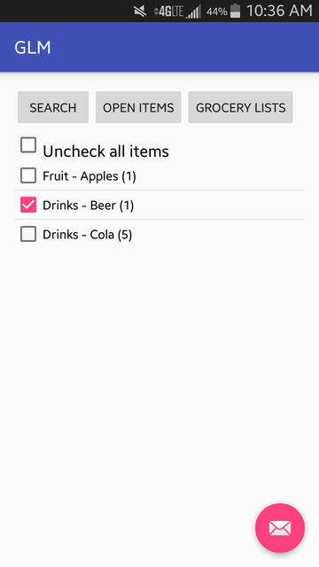

**Grocery List Manager**

* * *

Grocery list manager User Guide for Android devices

October 11, 2016 Revision 1.0

* * *

USE, DISCLOSURE, REPRODUCTION, MODIFICATION, TRANSFER, OR TRANSMITTAL OF THIS WORK FOR ANY PURPOSE IN ANY FORM OR BY ANY MEANS WITHOUT THE WRITTEN PERMISSION OF TEAM 71 IS STRICTLY PROHIBITED.

CONFIDENTIAL, UNPUBLISHED PROPERTY OF TEAM 71. USE AND DISTRIBUTION LIMITED SOLELY TO AUTHORIZED PERSONNEL.

* * *

©2016 Team 71, Inc. All Rights Reserved

<table>
  <tr>
    <td>Author</td>
    <td>Version </td>
    <td>Date</td>
    <td>Comments</td>
  </tr>
  <tr>
    <td>Team 71</td>
    <td>1.1</td>
    <td>10/19/2016</td>
    <td>Added instructions for search, selection, adding items etc. </td>
  </tr>
  <tr>
    <td>Team 71</td>
    <td>1.0</td>
    <td>10/11/2016</td>
    <td>Initial draft</td>
  </tr>
</table>

## **Who Should Read This Guide?**

This guide provides operation procedure for the users of Grocery List Manager android application. The guide is a reference guide for users to learn how to use the application and it also acts a reference.

## **1 Overview**

## **1.1 What Is Grocery List Manager?**

Grocery List Manager (GLM) is Android application that helps user manage their grocery list. The application allows a user to add items to a list, delete items from a list, and change the quantity of items in the list.

## **1.2 App installation**

The app can be installed by installing the application APK.

## **1.3 ****System configuration**

GLM application works in Android devices. The minimum device Android API level is API 19.

The app has been compiled using SDK version SD 24, the build tool version for the app is 24.0.1 and the Appcompat library is 24.2.1. The application stores the item data and the grocery list data locally on the device and doesn’t need network or internet access.

## **2 App usage**

## **2.1 Create grocery list**

1. Launch the app by tapping on the app icon on the application list on your device. When the app launches the user is presented with the launch screen.

2. Tap on the **CREATE LIST **button. Following screen is displayed prompting the user to enter their grocery list name.

3. Type in the grocery list name on the text edit field and tap **CREATE**.

4. The grocery list is saved and it is displayed on the user’s grocery list.

## **2.2 Rename a grocery list**

1. To perform this step there must be a grocery list on the app as shown in the figure below.

2. Long press on the grocery list that you want to rename.

3. A pop is displayed with two options:

		a. Change Name

		b. Delete List

4. Tap on the **Change Name**. A pop is displayed with a textedit field. Type in the new name as displayed below.

5. Tap on the save changes to save the new name for the list. A toast is displayed for successful renaming.

**		**

## **2.3 Delete a grocery list**

1. To perform this step there must be a grocery list created in the app as shown below.

2. Long press on the grocery list that you want to delete. A pop with two options is displayed:

1. Change Name

2. Delete List

3. Tap on the **Delete List**. The grocery list is deleted from the users grocery list. A toast is displayed for successful deletion. The app will not display the deleted grocery list.

## **2.4 Add items to a list**

1. To add items to a list there must be a grocery list created as below.

2. Tap in the grocery list item and the following screen is displayed. If the list is empty the display won’t have any items to it.

3. Tap on **OPEN ITEMS**. List of grocery list item types is displayed.

4. Tap on a item type. Items on that list are displayed as below.

5. Tap on an item to add the item. The item is now added to list with default quantity of 1.

6. Two items are now added to the list for purpose of this training document.

## **2.5 Specify quantity for an item**

## **2.5.1 Specify quantity for an item (1-9)**

1. Long press on the item that you want to change the quantify of. Following display will pop allowing the user to change the quantity.

2. Tap on the number of quantity of item you want to change.

3. Tap on Save Changes to finalize the quantity update.

## **2.5.2 Specify quantity for an item (more than 9)**

1. Long press on the item that you want to change the quantify of. Following display will pop allowing the user to change the quantity. To change the quantity by more than 9 at a time tap on the Set quantity at the bottom of the list.

2. A change quantity screen is displayed as below.

3. Type in the new amount that you want.

4. Tap on Save Changes to save the new quantity.

## **2.5.3 Delete an item from a list**

1. Long press on the item that you want to delete.

2. Tap on the 0 (Delete) at the top to delete the item. The item is deleted.

## **2.6 Search for an item**

1. To search an item by type and add to the grocery list a grocery list needs to be created as described in section **2.1 **and** 2.4**.

2. Tap on the grocery list name to display the items in the list.

3. Tap on the **Search**. A search box is displayed on the top of the screen.

4. Type in the item you want to search and tap on the search icon at the bottom right corner.

5. The item is displayed.

6. Tap on the item to add the item. The item is added to list. The following screen is displayed.

7. To go back to the grocery list tap on the** **Grocery Lists.

8. Tap on the grocery list to verify the item is added to the list.

## **2.7 Search for an item and save item to the list if not found**

1. To complete this task the user needs to be in a screen to search for items. Type in the item that you need to search and tap on the search.

2. If the item is not found the application will request user to add the item.

3. Tap on the message to add the items to the database. A display is provided to select the item type.

4. Tap on the item type. The item is added to the database and also the grocery list.

5. Tap on the grocery list to get back to the list of grocery list.

6. Tap on the grocery list name. The user is displayed with the items in the list.

## **2.8 Check off items in a list**

1. To check off items in a list there must be a list present with some items it it.

2. Tap on the grocery list to display the list of items.

3. Tap on the check box on the left of an item to check off an item.

4. Tap again on the check box if you want to uncheck the item.

## **2.9 Clear all check-off marks in a list**

1. To check off items in a list there must be a list present with some items it it.

2. Tap on the grocery list to display the list of items.

3. Tap on the Uncheck all to uncheck all items at once.

